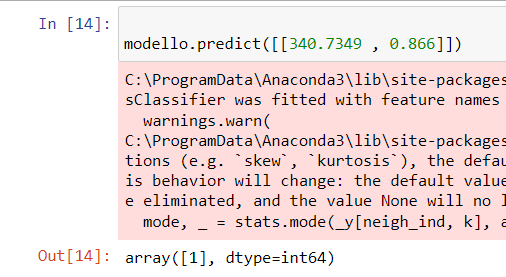

# K-Nearest Neighbors


L'algoritmo K-Nearest Neighbors (KNN) è un algoritmo di classificazione utilizzato nei modelli predittivi. Il suo obiettivo è suddividere dati simili in classi di appartenenza. Questo algoritmo si basa sulla prossimità dei dati per effettuare le classificazioni e costruire le varie classi basandosi sui vicini (neighbors) più prossimi. Il valore di K, che rappresenta il numero di vicini considerati, viene impostato all'inizio durante la creazione del modello predittivo.

# Esempio di Implementazione
Ecco un esempio di come implementare un modello predittivo utilizzando K-Nearest Neighbors:

```python
import pandas as pd
```
Definizione del dataframe (media e varianza delle time series).Un dataframe per il training e un altro per la predizione con Varianza e media calcolate dalle time series
```
d_train = {
    "ceppo": ['abete', 'leccio'],
    "devianza": [700.8056, 360.7349],
    "media": [1.3732, 1.1265],
    "target": [0, 1]
}

df = pd.DataFrame(data=d_train)
```
Creazione del modello e preparazione dei dati di apprendimento e Definizione di Training e Test set
```
X = df[df.columns[1:3]]  # Caratteristiche (features)
y = df["target"]         # Variabile target

from sklearn.neighbors import KNeighborsClassifier
modello = KNeighborsClassifier(1)  # Creazione del modello con K=1
modello.fit(X, y)  # Addestramento del modello
```
Predizione del modello che assegnerà l'etichetta corrispondente all'input 
```
modello.predict([[340.7349, 0.866]])--->0 oppure 1

```

